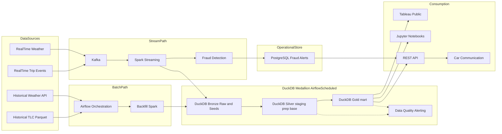
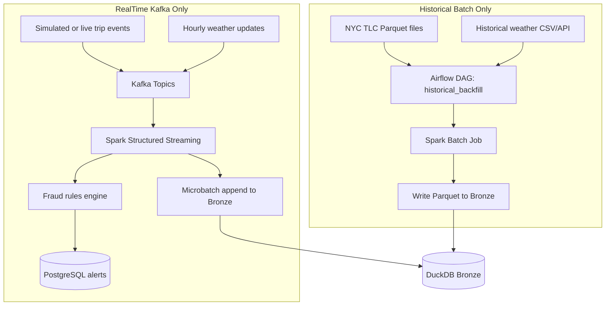
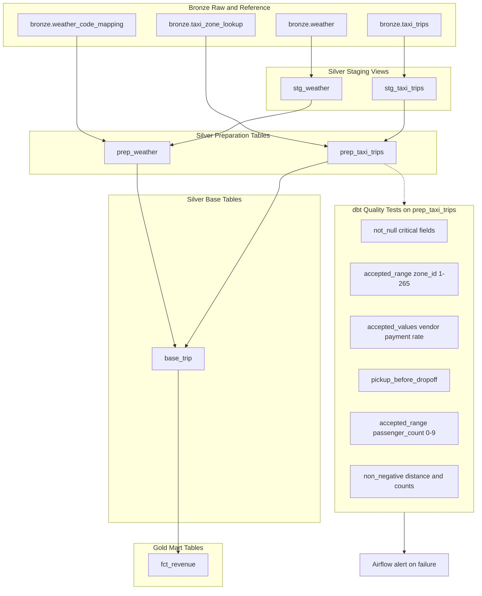
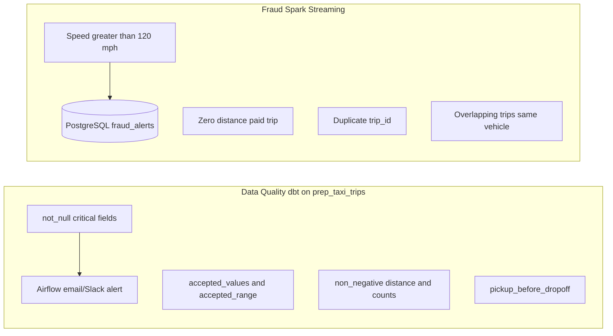
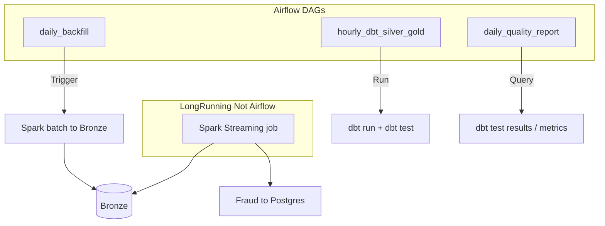
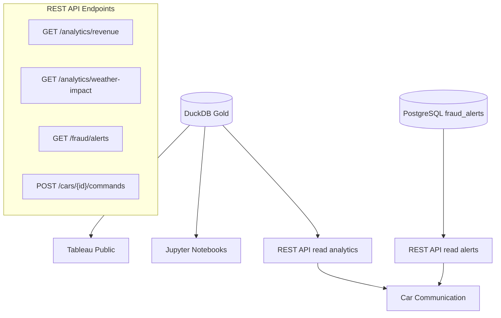

# ADR-001: Taxi Data Platform Architecture

| Field | Value |
|-------|-------|
| **Status** | Accepted |
| **Date** | 2026-06-06 |
| **Context** | Schwarz Engineering Case — global taxi operations (11,000+ vehicles), NYC Yellow Taxi POC |
| **Decisions** | Batch/stream split, DuckDB medallion, dbt, Kafka for real-time only |

---

## Context

We operate a global taxi business with more than 11,000 vehicles running 24/7. Headquarters must:

- Generate receipts and operational metrics (revenue, trip length, demand by city/zone)
- Detect fraud and support fleet planning
- **Send data back to individual vehicles** (pricing, routing, alerts)

For the POC we use **NYC Yellow Taxi TLC Parquet data** (~1 month) plus **matching historical weather**, with a **streaming path** simulated for live trips and weather. The solution must be flexible, production-oriented, and runnable locally with free/open-source tools—without cloud spend for the POC.

### Assignment mapping

| Requirement | Architecture component |
|-------------|------------------------|
| Collect, process, analyze trip data | Batch + streaming ingestion, DuckDB medallion |
| Send data back to cars | REST API → car communication |
| Load dataset + weather | Airflow-orchestrated backfill Spark |
| Data quality / timestamp checks | dbt tests + alerting on Silver/Gold |
| Join trips with weather | dbt Silver base layer (`base_trip`) |
| Analysis & visualization | DuckDB Gold → Tableau Public, Jupyter |

---

## Decision

We adopt a **Lambda-style architecture**: a **batch path** for historical loads and scheduled transformations, and a **speed path** for real-time ingestion, fraud detection, and operational alerts. **Kafka is used only on the real-time path**, not for bulk historical ingestion.

Analytical data lives in **DuckDB** using a **medallion layout** (Bronze → Silver → Gold) orchestrated by **Airflow** and transformed with **dbt**. **PostgreSQL** stores operational fraud alerts. **Tableau Public** and **Jupyter** consume Gold; **FastAPI** serves analytics and alerts to **car communication**.

---

## Architecture Overview

### High-level system diagram



### Ingestion paths (batch vs. stream)



**Clarification:** Historical TLC data never passes through Kafka. Bulk load is `Parquet → Spark batch → Bronze`. Kafka decouples live producers from consumers and enables replay at production scale.

---

## Medallion architecture (DuckDB + dbt)

The dbt project lives at `src/transformation/taxi` and implements a **four-step Silver pipeline** (staging → preparation → base) followed by a **Gold mart** layer. DuckDB schemas map directly to medallion tiers via `dbt_project.yml`:

| dbt folder | DuckDB schema | Materialization | Medallion tier |
|------------|---------------|-----------------|----------------|
| `seeds/` | `bronze` | seed | Bronze (reference data) |
| `models/staging/` | `silver` | view | Silver — staging |
| `models/preparation/` | `silver` | table | Silver — preparation |
| `models/base/` | `silver` | table | Silver — business entities |
| `models/mart/` | `gold` | table | Gold — analytics |



### Bronze layer

| Object | Written by | Purpose |
|--------|------------|---------|
| `bronze.taxi_trips` | Batch ingestion (`ingestion.batch.main`) | Raw NYC TLC Yellow Taxi Parquet with lineage columns |
| `bronze.weather` | Weather ingestion (`ingestion.historical_weather.main`) | Hourly archive weather per taxi-zone coordinate |
| `bronze.taxi_zone_lookup` | dbt seed | TLC zone ID → borough, zone name, latitude, longitude |
| `bronze.weather_code_mapping` | dbt seed | WMO weather code → description and category |

**Bronze lineage columns** on `taxi_trips` (batch path implemented):

- `ingestion_ts` — when the record was loaded
- `source_type` — `batch_backfill` (streaming path will add `stream_live`)
- `source_file` — source Parquet file path
- `record_hash` — SHA-256 deduplication key; batch ingestion merges on this column

**Idempotent backfills:** The batch job merges on `record_hash` so re-runs do not duplicate trip rows.

### Silver layer — staging (`models/staging/`)

Lightweight **views** that cast Bronze sources to typed columns. No cleansing or business rules.

| Model | Source | Responsibility |
|-------|--------|----------------|
| `stg_taxi_trips` | `bronze.taxi_trips` | Cast trip fields to `INTEGER`, `DOUBLE`, `TIMESTAMP`, `VARCHAR` |
| `stg_weather` | `bronze.weather` | Cast `latitude`, `longitude`, `timestamp`, `weather_code` |

### Silver layer — preparation (`models/preparation/`)

**Tables** that apply cleansing, reference-data enrichment, and data-quality tests.

| Model | Inputs | Responsibility |
|-------|--------|----------------|
| `prep_taxi_trips` | `stg_taxi_trips`, `taxi_zone_lookup` | Enrich trips with pickup/dropoff zone names and coordinates; enforce TLC field constraints via dbt tests |
| `prep_weather` | `stg_weather`, `weather_code_mapping` | Attach human-readable weather description and category to hourly codes |

**Data quality tests** on `prep_taxi_trips` (defined in `prep_taxi_trips.yml`):

- `pickup_before_dropoff` — custom generic test
- `not_null` — vendor, timestamps, passenger count, trip distance, zone IDs, payment type
- `accepted_values` — vendor ID, payment type, store-and-forward flag, rate code
- `accepted_range` — zone IDs (1–265), passenger count (0–9)
- `non_negative` — trip distance, passenger count

### Silver layer — base (`models/base/`)

**Entity tables** that combine prepared datasets into analysis-ready grains.

| Model | Inputs | Responsibility |
|-------|--------|----------------|
| `base_trip` | `prep_taxi_trips`, `prep_weather` | Trip grain enriched with pickup and dropoff weather |

### Trip–weather join (`base_trip`)

The join is implemented in **dbt Silver base**, not in the API:

1. `prep_taxi_trips` — trips with zone names and zone-centroid coordinates from `taxi_zone_lookup`
2. `prep_weather` — hourly weather with WMO code labels from `weather_code_mapping`
3. `base_trip` — left-join weather twice (pickup and dropoff) on:
   - `date_trunc('hour', pickup_datetime) = weather.timestamp` (and same for dropoff)
   - matching `latitude` and `longitude` between trip zone centroid and weather observation point

Output columns include `pickup_weather`, `pickup_weather_category`, `dropoff_weather`, and `dropoff_weather_category` alongside core trip attributes.

### Gold layer — mart (`models/mart/`)

**Aggregated tables** for BI dashboards and API endpoints.

| Model | Grain | Metrics |
|-------|-------|---------|
| `fct_revenue` | `pickup_datetime`, `pickup_zone`, `pickup_weather_category` | `revenue` (sum of fare), `trip_distance`, `trip_count` |

Planned Gold models (not yet implemented): hourly/daily trip volumes, top zones, and dedicated weather-impact summaries. `fct_revenue` already supports weather-impact analysis by grouping on `pickup_weather_category`.

### Layer summary

| Layer | Contents | Written by | Transformed by |
|-------|----------|------------|----------------|
| **Bronze** | Raw trips, weather, and reference seeds | Batch/weather ingestion, dbt seed | — |
| **Silver (staging)** | Typed views over Bronze | — | dbt views |
| **Silver (preparation)** | Cleansed, enriched, tested tables | — | dbt tables + tests |
| **Silver (base)** | Joined business entities (trip + weather) | — | dbt tables |
| **Gold** | Aggregated facts for analytics | — | dbt mart tables |

### Running the pipeline

```bash
cd src
export DBT_PROFILES_DIR=transformation/taxi
export DUCKDB_PATH=data/taxi.duckdb

uv run dbt seed --project-dir transformation/taxi   # bronze reference data
uv run dbt run --project-dir transformation/taxi     # silver + gold models
uv run dbt test --project-dir transformation/taxi    # data quality gates
```

---

## Data quality vs. fraud detection

These are **separate concerns** with different tools and SLAs.



| Concern | Tool | SLA | Storage |
|---------|------|-----|---------|
| Data quality | dbt tests on `prep_taxi_trips` (Silver preparation) | Batch (hourly/daily) | Test results → Airflow alerting |
| Fraud | Spark Streaming rules | Near real-time (< 1 min) | PostgreSQL `fraud_alerts` |

---

## Orchestration (Airflow)



**Airflow orchestrates:** backfill Spark, dbt (`run`, `test`), quality report DAGs.

**Not Airflow:** Kafka consumers and Spark Streaming (long-running processes via Docker/systemd/Kubernetes in production).

---

## Consumption layer



| Consumer | Data source | Purpose |
|----------|-------------|---------|
| Tableau Public | DuckDB Gold — `fct_revenue` (ODBC or exported Parquet/CSV) | Dashboards: revenue by zone, weather impact, temporal patterns |
| Jupyter | DuckDB Gold + Silver | Ad-hoc analysis, statistical tests |
| REST API | DuckDB Gold (read-only analytics) | Query aggregates for apps |
| REST API | PostgreSQL (fraud alerts) | Operational alerts, investigation queue |
| Car communication | REST API `POST /cars/{id}/commands` | Dynamic pricing, route hints, fraud lockout, dispatch |

**API design:** Raw Bronze is not exposed. Analytics endpoints read Gold; alert endpoints read Postgres.

### Car communication (feedback loop)

Examples of downstream commands sent to vehicles:

- Surge pricing updates by zone
- Route suggestions (avoid weather/traffic hotspots)
- Fraud lockout or manual review flag
- Dispatch / repositioning hints based on demand Gold metrics

---

## Technology stack

| Component | Technology | Role |
|-----------|------------|------|
| Batch processing | Apache Spark (batch) | Historical backfill to Bronze |
| Stream processing | Apache Spark Structured Streaming | Micro-batch to Bronze + fraud |
| Message broker | Apache Kafka | Real-time path only |
| Analytical store | DuckDB | Bronze / Silver / Gold medallion |
| Transformations | dbt | Silver (staging → preparation → base) + Gold mart + quality tests |
| Operational store | PostgreSQL | Fraud alerts |
| Orchestration | Apache Airflow | Backfill, dbt, quality reports |
| Visualization | Tableau Public | Dashboards |
| Analysis | Jupyter | Notebooks |
| API | FastAPI | Analytics + alerts + car commands |
| File format | Parquet | Source files and Bronze storage |
| Containerization | Docker Compose | Local POC |

### Out of POC scope (production only)

- **S3 object storage:** Raw TLC archive, Bronze/Silver Parquet lake, backups, disaster recovery. Mentioned for production; not implemented locally.
- **ML pipelines:** Demand forecasting, ML-based fraud — future phase.

---

## Streaming → Bronze pattern

Spark Structured Streaming writes to Bronze using **micro-batches** (e.g. every 1–5 minutes):

1. Consume from Kafka topics `taxi.trips.live`, `weather.hourly`
2. Apply minimal validation (schema, required fields)
3. Append Parquet files to `bronze/taxi_trips/` and `bronze/weather/` with `source_type = stream_live`
4. Airflow-triggered dbt run (hourly) picks up new Bronze partitions for Silver/Gold

For POC, historical replay can simulate live events into Kafka without loading history through Kafka for the initial bulk dataset.

---

## Production scaling notes

At ~11,000 cars globally:

- **Kafka:** Partition by city/vehicle; replication factor 3; retention 7–30 days
- **Spark Streaming:** Autoscaling executors; separate fraud job if needed
- **DuckDB:** Suitable for POC and edge analytics; migrate Gold to cloud warehouse (Snowflake, BigQuery, Redshift) when data exceeds ~100 GB or concurrent BI users grow
- **Postgres:** HA with read replicas for API
- **S3:** Data lake for Bronze/Silver Parquet, lifecycle to Glacier

Estimated production path on AWS: MSK + EMR/Glue + RDS Postgres + S3 + MWAA + Tableau Cloud.

---

## Consequences

### Positive

- Clear separation of batch (history) and stream (live) ingestion
- Medallion + dbt gives testable, version-controlled transformations
- DuckDB enables fast local analytics and Tableau integration at zero cost
- Fraud isolated on streaming path with operational Postgres store
- Architecture maps directly to assignment sections

### Negative / trade-offs

- Two writers to Bronze require schema discipline and lineage columns
- dbt on DuckDB is less mature than on Snowflake/BigQuery; acceptable for POC
- Tableau Public requires publish step and has data visibility limits
- Spark Streaming + Kafka adds operational complexity vs. batch-only POC

### Risks and mitigations

| Risk | Mitigation |
|------|------------|
| Duplicate trips on backfill re-run | `record_hash` merge at Bronze ingestion; `pickup_before_dropoff` and zone tests in Silver preparation |
| Streaming lag | Monitor Kafka consumer lag; scale Spark executors |
| dbt test failures block pipeline | Alert only on Gold; Silver warnings vs. errors by severity |
| DuckDB size limits | Export Gold to Parquet; plan warehouse migration |

---

## POC success criteria

- [x] Ingest 2 months NYC Yellow Taxi + matching weather via batch path
- [x] Bronze → Silver (staging → preparation → base) → Gold (`fct_revenue`) pipeline with dbt
- [x] Data quality tests on `prep_taxi_trips` (null checks, zone ranges, pickup before dropoff)
- [x] Weather join in `base_trip` with pickup and dropoff weather categories
- [ ] Spark Streaming + Kafka path demonstrated (simulated live events)
- [ ] Fraud rules write alerts to PostgreSQL
- [x] Tableau Public dashboards published (weather impact, hourly/daily patterns)
- [ ] REST API serves analytics and car commands
- [ ] Docker Compose runs core services locally

---

## References

- [NYC TLC Trip Record Data](https://www1.nyc.gov/site/tlc/about/tlc-trip-record-data.page)
- [Engineering Case](../Engineering%20Case.pdf) — Schwarz assignment brief
- Medallion architecture (Databricks)
- ADR format: [Michael Nygard — Documenting Architecture Decisions](https://cognitect.com/blog/2011/11/15/documenting-architecture-decisions)

---

## Diagram index

1. **High-level system** — end-to-end flow
2. **Ingestion paths** — batch vs. Kafka stream
3. **Medallion + dbt** — Bronze → Silver (staging/preparation/base) → Gold mart and tests
4. **Quality vs. fraud** — separation of concerns
5. **Airflow orchestration** — scheduled vs. long-running jobs
6. **Consumption** — Tableau, Jupyter, API, car communication
