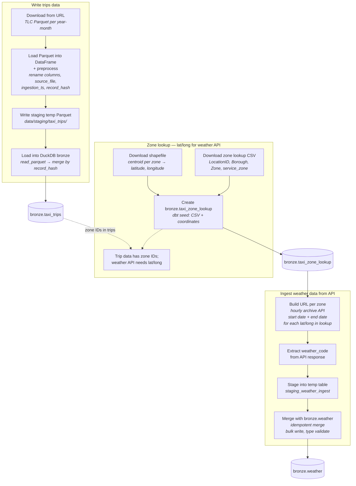
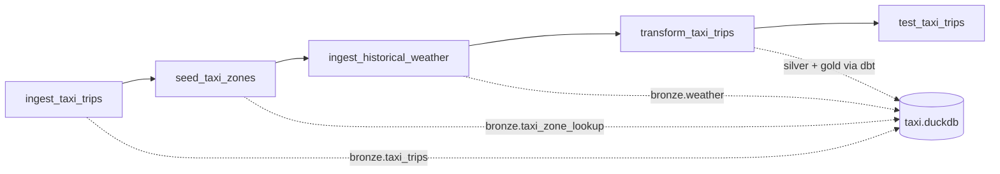

# Batch ingestion flow

End-to-end batch ingestion for NYC TLC taxi trips, zone lookup reference data, and historical weather into DuckDB bronze. This diagram mirrors the ingestion design sketch and maps to `ingestion/batch`, `ingestion/historical_weather`, and dbt seeds.

## Flow diagram

## Simplified orchestration view

How the three flows run in the Airflow DAG (`taxi_etl`):

## Code mapping

| Step | Implementation |
|------|----------------|
| Download TLC Parquet | `ingestion/batch/main.py` → `_download_parquet_files` |
| Transform + lineage columns | `ingestion/batch/main.py` → `_transform` |
| Staging Parquet | `ingestion/batch/main.py` → `_write_staging` |
| Merge into bronze | `ingestion/batch/duckdb_writer.py` → `DuckDBBronzeWriter.write` |
| Zone lookup + coordinates | `transformation/taxi/seeds/taxi_zone_lookup.csv` (dbt seed) |
| Weather URL + fetch | `ingestion/historical_weather/main.py` |
| Weather temp table + merge | `ingestion/historical_weather/duckdb_writer.py` |

## Idempotency

| Dataset | Dedup key | Re-run behavior |
|---------|-----------|-----------------|
| Taxi trips | `record_hash` | Delete matching hashes, then insert (no duplicates) |
| Weather | `(latitude, longitude, timestamp)` | Delete matching keys, then insert (no duplicates) |
| Zone lookup | dbt seed | Full refresh on `dbt seed` |
